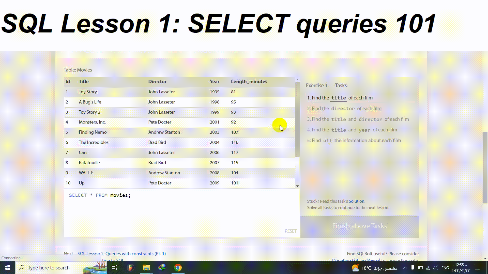

# [ SQLBolt](https://sqlbolt.com/)

## SQL Lesson 1: SELECT queries 101
We will be using a database with data about some of Pixar's classic movies for most of our exercises. This first exercise will only involve the Movies table, and the default query below currently shows all the properties of each movie. To continue onto the next lesson, alter the query to find the exact information we need for each task.

## Exercise 1 — Tasks
1. Find the title of each film
2. Find the director of each film
3. Find the title and director of each film
4. Find the title and year of each film
5. Find all the information about each film

[Click here to see the details](https://sqlbolt.com/lesson/select_queries_introduction)

## Solution:
