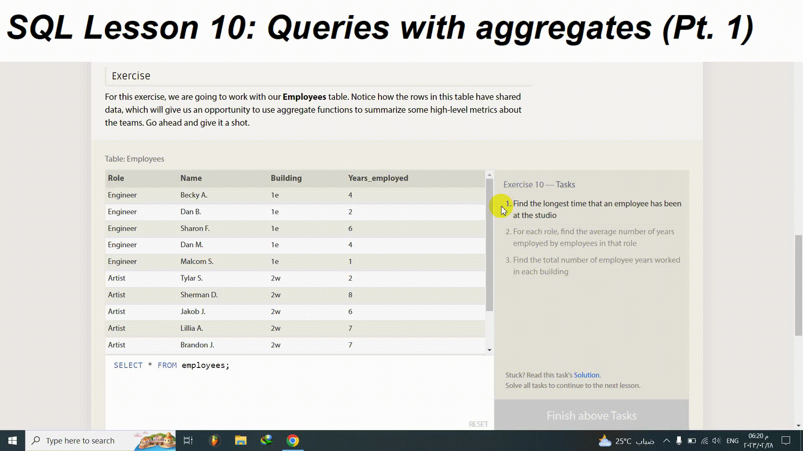

# [ SQLBolt](https://sqlbolt.com/)

## SQL Lesson 10: Queries with aggregates (Pt. 1)
For this exercise, we are going to work with our Employees table. Notice how the rows in this table have shared data, which will give us an opportunity to use aggregate functions to summarize some high-level metrics about the teams. Go ahead and give it a shot.

## Table: Employees

Role|Name|Building|Years_employed
-:|-:|-:|-:|
Engineer|Becky A.|1e|4
Engineer|Dan B.|1e|2
Engineer|Sharon F.|1e|6
Engineer|Dan M.|1e|4
Engineer|Malcom S.|1e|1
Artist|Tylar S.|2w|2
Artist|Sherman D.|2w|8
Artist|Jakob J.|2w|6
Artist|Lillia A.|2w|7
Artist|Brandon J.|2w|7
Manager|Scott K.|1e|9
Manager|Shirlee M.|1e|3
Manager|Daria O.|2w|6

## Exercise 10 — Tasks
1. Find the longest time that an employee has been at the studio
2. For each role, find the average number of years employed by employees in that role
3. Find the total number of employee years worked in each building

[Click here to see the details](https://sqlbolt.com/lesson/select_queries_with_aggregates)

## Solution:

