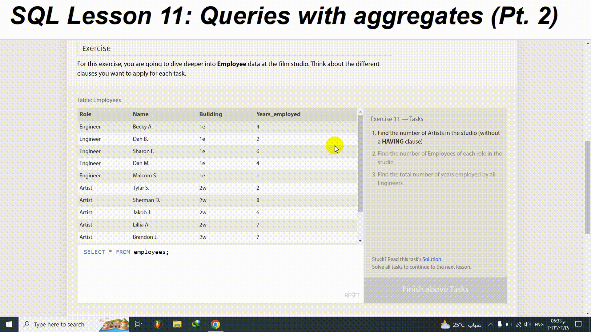

# [ SQLBolt](https://sqlbolt.com/)

## SQL Lesson 11: Queries with aggregates (Pt. 2)
For this exercise, you are going to dive deeper into Employee data at the film studio. Think about the different clauses you want to apply for each task.

## Table: Employees

Role|Name|Building|Years_employed
-:|-:|-:|-:|
Engineer|Becky A.|1e|4
Engineer|Dan B.|1e|2
Engineer|Sharon F.|1e|6
Engineer|Dan M.|1e|4
Engineer|Malcom S.|1e|1
Artist|Tylar S.|2w|2
Artist|Sherman D.|2w|8
Artist|Jakob J.|2w|6
Artist|Lillia A.|2w|7
Artist|Brandon J.|2w|7
Manager|Scott K.|1e|9
Manager|Shirlee M.|1e|3
Manager|Daria O.|2w|6

## Exercise 11  — Tasks
1. Find the number of Artists in the studio (without a HAVING clause)
2. Find the number of Employees of each role in the studio
3. Find the total number of years employed by all Engineers

[Click here to see the details](https://sqlbolt.com/lesson/select_queries_with_aggregates_pt_2)

## Solution:
