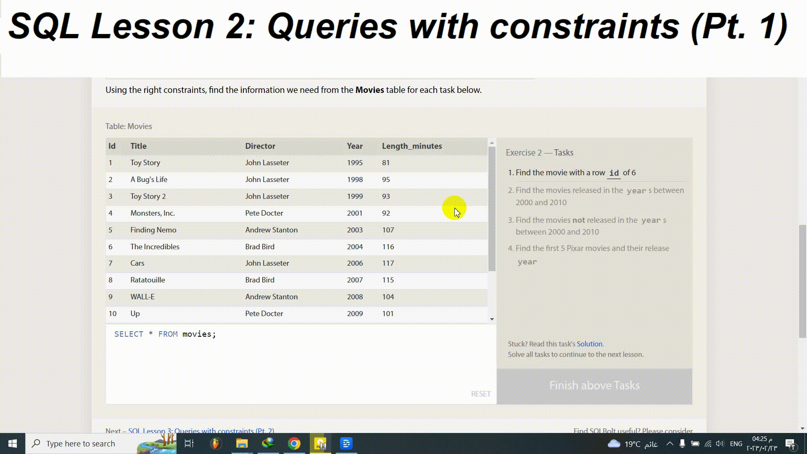

# [ SQLBolt](https://sqlbolt.com/)

## SQL Lesson 2: Queries with constraints (Pt. 1)
Using the right constraints, find the information we need from the Movies table for each task below.

## Exercise 2 — Tasks
1. Find the movie with a row id of 6
2. Find the movies released in the years between 2000 and 2010
3. Find the movies not released in the years between 2000 and 2010
4. Find the first 5 Pixar movies and their release year

[Click here to see the details](https://sqlbolt.com/lesson/select_queries_with_constraints)

## Solution:
