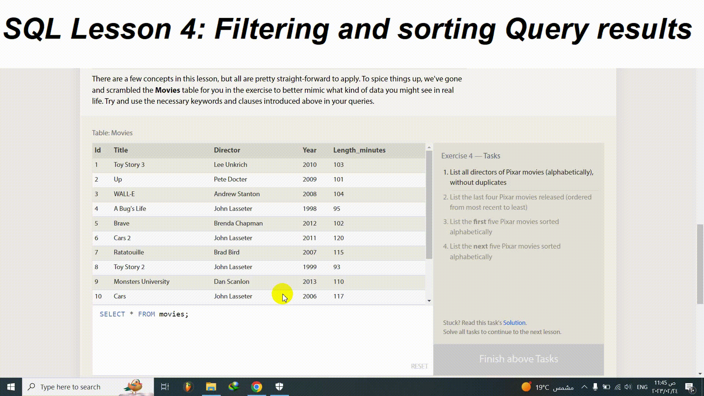

# [ SQLBolt](https://sqlbolt.com/)

## SQL Lesson 4: Filtering and sorting Query results
There are a few concepts in this lesson, but all are pretty straight-forward to apply. To spice things up, we've gone and scrambled the Movies table for you in the exercise to better mimic what kind of data you might see in real life. Try and use the necessary keywords and clauses introduced above in your queries.

## Exercise 4 — Tasks
1. List all directors of Pixar movies (alphabetically), without duplicates
2. List the last four Pixar movies released (ordered from most recent to least)
3. List the first five Pixar movies sorted alphabetically
4. List the next five Pixar movies sorted alphabetically

[Click here to see the details](https://sqlbolt.com/lesson/filtering_sorting_query_results)

## Solution:
